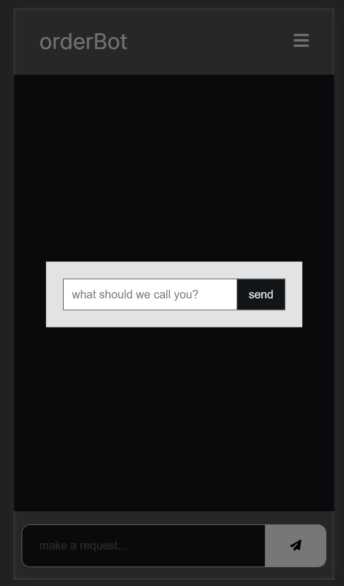
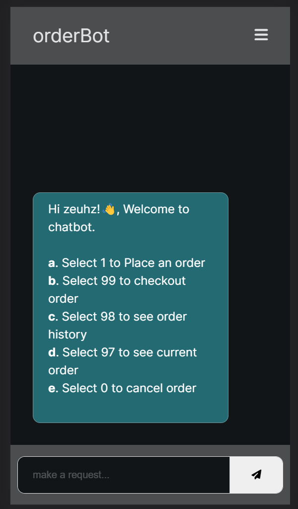
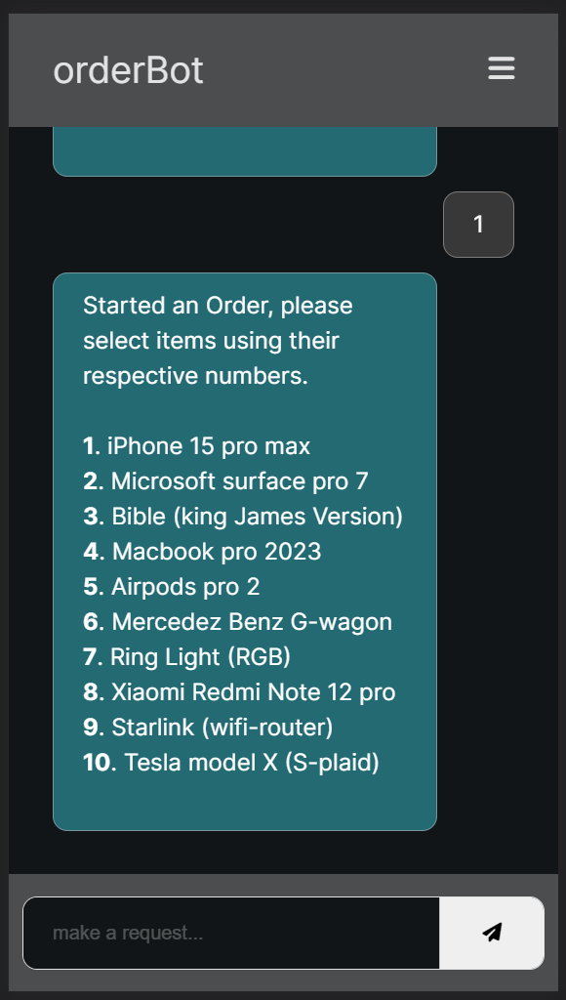
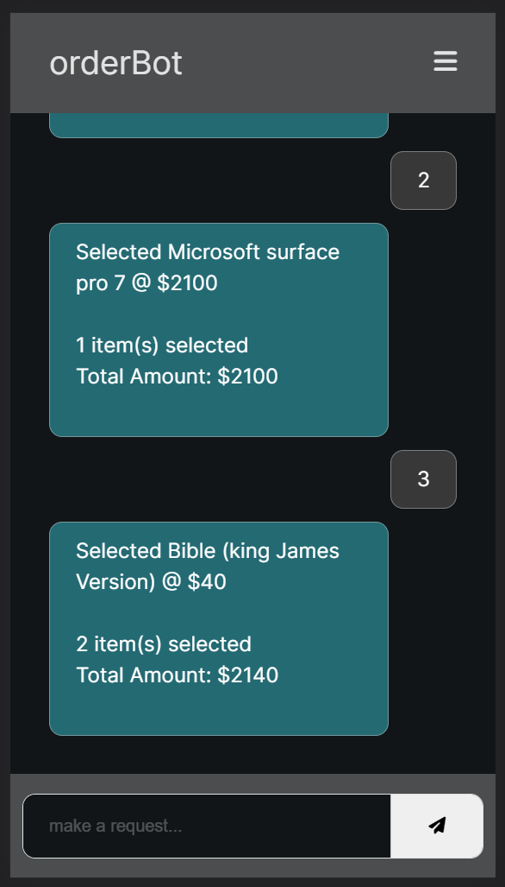
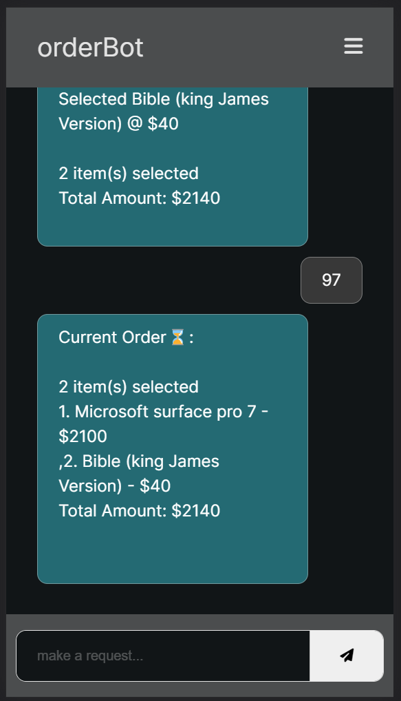
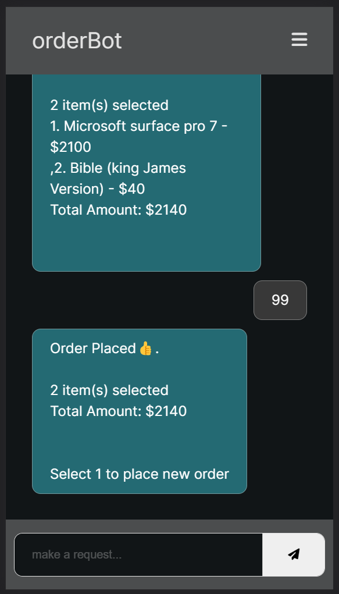
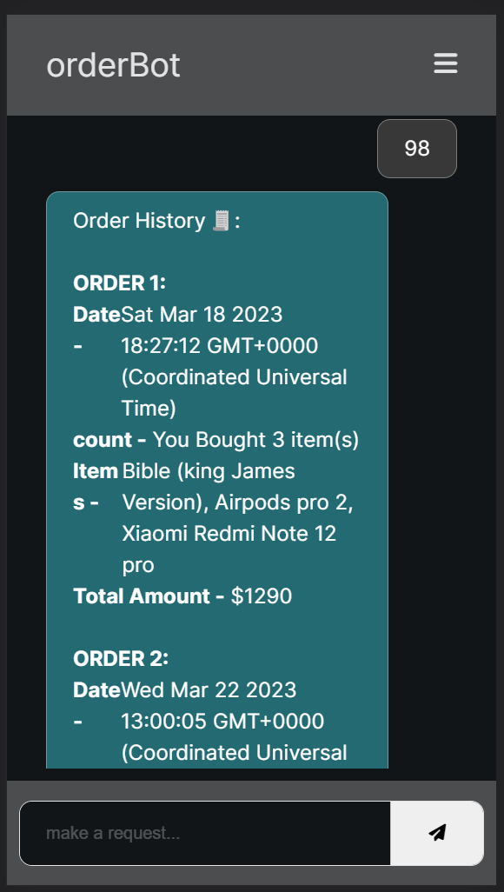
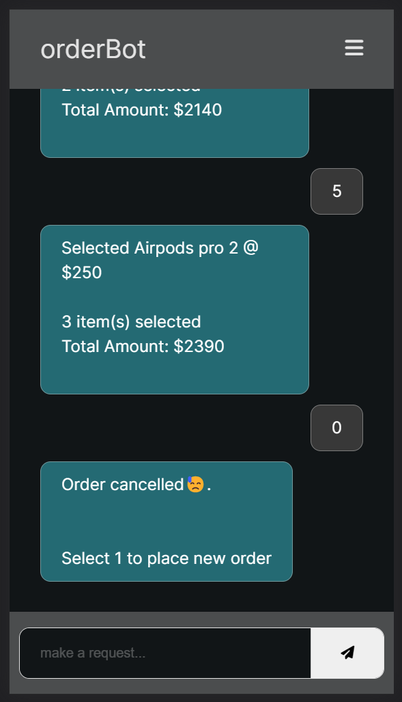

# **orderBot**

This is an API for a chat Bot to make orders.

## Requirements

- ChatBot interface would be like a chat interface
- No need for authentication but we should be able to store user session based on
  devices.
- When a customer lands on the chatbot page, the bot should send these options to the
  customer:
  a. Select 1 to Place an order
  b. Select 99 to checkout order
  c. Select 98 to see order history
  d. Select 97 to see current order
  e. Select 0 to cancel order 4. When a customer selects “1”, the bot should return a list of items from the restaurant.
- It is up to you to create the items in your restaurant for the customer. The order items can
  have multiple options but the customer should be able to select the preferred items from
  the list using this same number select system and place an order.
- When a customer selects “99” out an order, the bot should respond with “order placed”
  and if none the bot should respond with “No order to place”. Customer should also see
  an option to place a new order.
- When a customer selects “98”, the bot should be able to return all placed order.
- When a customer selects “97”, the bot should be able to return current order.
- When a customer selects “0”, the bot should cancel the order if there is.

## Setup

- Install NodeJS, mongodb
- pull this repo
- update `env` with example.env
- run `npm run start:dev`

---

## Base URL

[orderBot](https://zeuhz-orderbot-droid.onrender.com/)

### order

| field       | data_type | constraints                   |
| ----------- | --------- | ----------------------------- |
| id          | string    | required                      |
| items       | string    | required                      |
| itemsCount  | Number    | optional                      |
| amount      | Number    | optional                      |
| dateCreated | Date      | optional, default: new Date() |
| merchant    | string    | optional                      |
| cancelled   | Boolean   | optional, default: false      |
| fulfilled   | string    | optional, default: false      |



### getInfoABoutApp

- Route: /api/v1/chatbot/
- Method: POST
- Body: {
  "username": "name"
  }

```JavaScript
message: "success",
data: {
    instructions: [
        {
        option: 'a',
        instruction: 'Select 1 to Place an order',
        },
        {
        option: 'b',
        instruction: 'Select 99 to checkout order',
        },
        .
        .
    ],
}
```



### placeOrder

- Route: /api/v1/chatbot/1
- Method: GET
- Body:

```JavaScript
message: "success",
Items : [
    {
    id: 1,
    item: 'iPhone 15 pro max',
    description: 'Apple company latest flagish phone',
    amount: 1500,
  },
  .
  .
]
```



### selectAnItem

- Route: /api/v1/chatbot/1/:id
- Method: GET
- Body:

```JavaScript
{
    "status": "success",
    "message": 'Order Placed👍.',
    "status": "success",
    "message": "Selected ${item}",
    "data": {
        "order": {
            "_id": "641a8b198b6d5c48a14b8422",
            "items": [
                {
                    "item": "Microsoft surface pro 7",
                    "amount": 2100
                }
            ],
            "dateCreated": "Wed Mar 22 2023 04:51:38 GMT+0000 (Coordinated Universal Time)",
            "merchant": "Juse",
            "cancelled": false,
            "fulfilled": false,
            "__v": 0,
            "amount": 2100,
            "itemsCount": 1
        }
    }
}
```



### currentOrder

- Route: /api/v1/chatbot/97
- Method: GET
- Body:

```JavaScript
{
    "status": "success",
    "message": "Current Order⌛:",
    "data": {
        "currentOrder": {
            "_id": "641afc38811ae47b387f4793",
            "id": 24,
            "items": [
                {
                    "item": "Microsoft surface pro 7",
                    "amount": 2100
                },
                {
                    "item": "Bible (king James Version)",
                    "amount": 40
                }
            ],
            "dateCreated": "Wed Mar 22 2023 13:00:05 GMT+0000 (Coordinated Universal Time)",
            "merchant": "Juse",
            "cancelled": false,
            "fulfilled": false,
            "__v": 0,
            "amount": 100250,
            "itemsCount": 2
        }
    }
}
```



### checkoutOrder

- Route: /api/v1/chatbot/1
- Method: GET
- Body:

```JavaScript
{
    "status": "success",
    "message": "Order Placed👍.",
    "data": {
        "order": {
            "_id": "641a8b198b6d5c48a14b8422",
            "id": 23,
            "items": [
                {
                    "item": "Microsoft surface pro 7",
                    "amount": 2100
                },
                {
                    "item": "Airpods pro 2",
                    "amount": 250
                }
            ],
            "dateCreated": "Wed Mar 22 2023 04:51:38 GMT+0000 (Coordinated Universal Time)",
            "merchant": "Juse",
            "cancelled": false,
            "fulfilled": true,
            "__v": 0,
            "amount": 2350,
            "itemsCount": 2
        }
    }
}
```



### orderHistory

- Route: /api/v1/chatbot/98
- Method: GET
- Body:

```JavaScript
{
    "status": "success",
    "message": "Order History🧾:",
    "count": 1,
    "data": {
        "orders": [
            {
                "_id": "6416d411ec871cd9f63c8cc8",
                "id": 2,
                "items": [
                    {
                        "item": "Microsoft surface pro 7",
                        "amount": 2100
                    },
                    {
                        "item": "Bible (king James Version)",
                        "amount": 40
                    },
                ],
                "dateCreated": "Sun Mar 19 2023 09:16:43 GMT+0000 (Coordinated Universal Time)",
                "cancelled": false,
                "fulfilled": true,
                "__v": 0,
                "amount": 281340,
                "itemsCount": 2
            }
        ]
    }
}
```



### cancelOrder

- Route: /api/v1/chatbot/0
- Method: GET
- Body:

```JavaScript
{
    "status": "success",
    "message": "Order cancelled😓."
}
```



## Contributor

- Zeuhz Droid(David A.)
